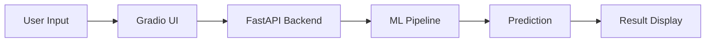

# 🥗 Food Health Checker AI

<p align="center">
  
  
  
  
</p>

---

## 🚀 Overview

**Food Health Checker AI** is an industry-style machine learning project that predicts whether a food item is **Healthy or Unhealthy** using **USDA nutrient data**.

It includes:

✅ ML Pipeline (Imputer + SMOTE + PCA + Model)  
✅ FastAPI Backend (Production-ready API)  
✅ Gradio UI (Interactive frontend)   
✅ Clean modular structure (like real-world projects)

---

## 🧠 ML Pipeline

```
Imputer → Scaler → SMOTE → PCA → RandomForest
```

| Step     | Purpose                  |
|----------|--------------------------|
| Imputer  | Handle missing values    |
| Scaler   | Normalize features       |
| SMOTE    | Balance dataset          |
| PCA      | Reduce dimensions        |
| Model    | Predict health score     |

---

## 📊 Input Features

| Feature  | Unit |
|----------|------|
| Calories | kcal |
| Protein  | g    |
| Fat      | g    |
| Carbs    | g    |
| Sugar    | g    |
| Fiber    | g    |
| Sodium   | mg   |

---

## 🎯 Output Example

```json
{
  "prediction": "Healthy 🟢",
  "confidence": 0.87
}
```

---

## ⚙️ Workflow



---

## 🗂️ Project Structure

```
food-health-checker/
│
├── data/
│   └── food.csv
│
├── model/
│   └── pipeline.pkl
│
├── src/
│   ├── train.py
│   ├── predict.py
│   ├── utils.py
│
├── app/
│   ├── api.py
│   └── gradio_app.py
│
├── requirements.txt
└── README.md
```

---

## ⚡ Quick Start

### 1️⃣ Clone Repository

```bash
git clone https://github.com/your-username/food-health-checker.git
cd food-health-checker
```

### 2️⃣ Setup Environment

```bash
python -m venv venv
venv\Scripts\activate   # Windows
pip install -r requirements.txt
```

### 3️⃣ Train Model

```bash
python src/train.py
```

### 4️⃣ Run FastAPI

```bash
uvicorn app.api:app --reload
```

📌 API Docs:  
http://127.0.0.1:8000/docs

---

## 🎨 Run Gradio UI

```bash
python app/gradio_app.py
```

---

## 🔍 Example API Request

```json
POST /predict

{
  "calories": 250,
  "protein": 10,
  "fat": 8,
  "carbs": 30,
  "sugar": 5,
  "fiber": 4,
  "sodium": 300
}
```

---

## 📦 Tech Stack

| Category        | Tools Used                     |
|----------------|------------------------------|
| ML             | Scikit-learn, SMOTE, PCA     |
| Backend        | FastAPI                      |
| Frontend       | Gradio                       |
| Model Storage  | Joblib                       |
| Data           | USDA Food Nutrients          |

---


## 🧠 Future Improvements

- 🔥 Deep Learning Model  
- 📱 Mobile App Integration  
- 🌐 Deploy on AWS / GCP  
- 🥦 Real-time food scanning  

---

## 🤝 Contributing

Pull requests are welcome!

---

## ⭐ Support

If you like this project:

👉 Star ⭐ the repo  
---

## 👨‍💻 Author

**Muhammad Osama Rana**

---
